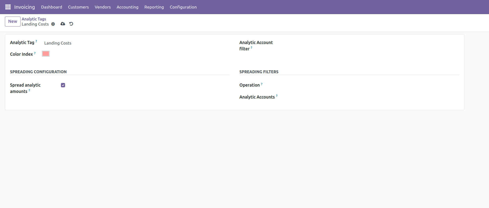
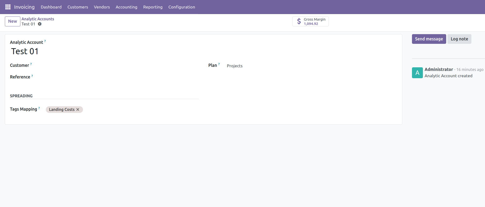

1. Configuration
Before using the module, you need to configure the Analytic Tags and Analytic Accounts.

Analytic Tags: Go to Accounting > Configuration > Analytic Accounting > Analytic Tags. Create a new tag a enable 'Spread analytic amounts'. Include or exclude analytic account while spreading setting filter in the same view.

Analytic Accounts: Go to Accounting > Configuration > Analytic Accounting > Analytic Accounts. Create new accounts as needed and set tags mapping field.

