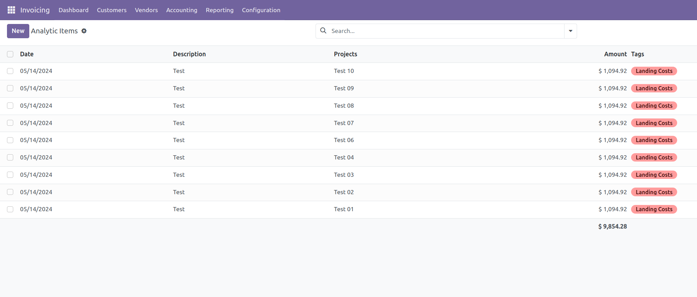

Usage

1. When creating an invoice or a move line, you can assign Analytic Tags to each invoice line. These tags will be used to distribute the cost of the line across the associated Analytic Accounts.

Go to Accounting > Customers > Invoices. Click on "Create" to create a new invoice.

In the invoice lines, select the product, enter the quantity and price, and set an analytic tags preconfigurated for spreading.

2. Posting the invoice or move, the module will automatically create analytic lines for each invoice line based on the associated analytic tags.

Click on "Post" to post the invoice.

3. Go to Accounting > Analytic Accounting > Analytic Items to see the created analytic lines.

Cancelling the invoice the module will automatically delete the associated analytic lines.

4. Go to the invoice and click on "Action" > "Cancel". The associated analytic lines will be deleted.
