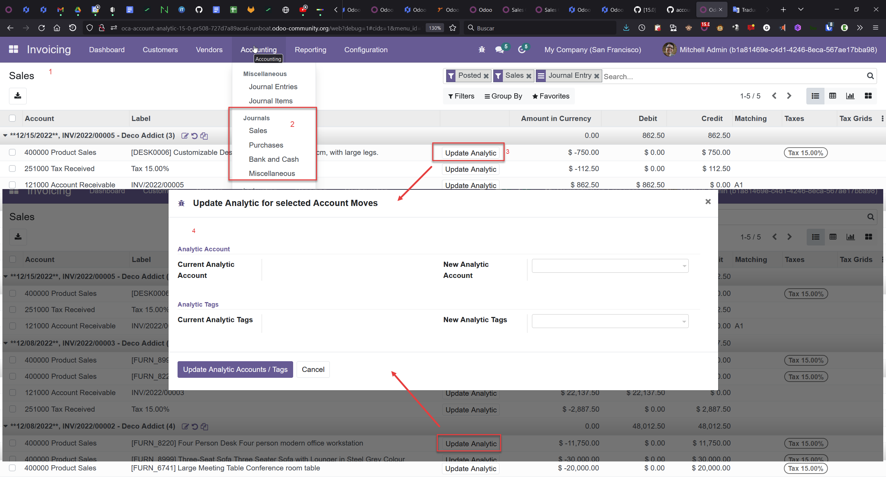

1.  First of all, make sure that your respective user has the specific
    Analytic Accounting role.
2.  In a posted move and from customer invoices and vendor bills, go to
    the move line you want to update, and click on 'Update analytic' to
    open the wizard. (You also have the button directly on account move
    lines).
3.  Current analytic account and tags are shown, you can select another
    one then click on Confirm
4.  Analytic lines will be dropped from current analytic account and
    recreated on new analytic distribution.

