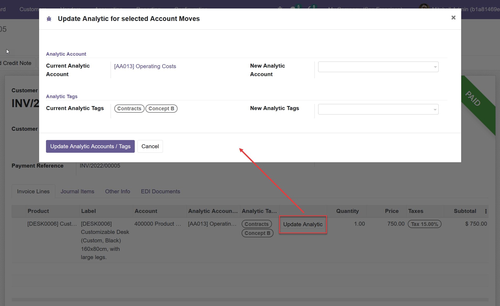
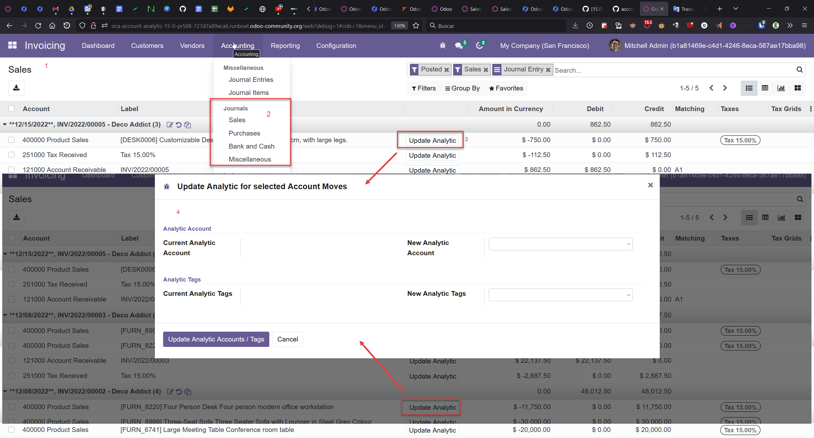

1. In a posted move and from customer invoices and vendor bills, go to the move line you want to update, and click on 'Update analytic' to open the wizard. (You also have the button directly on account move lines).
2. Current analytic account and tags are shown, you can select another one then click on Confirm
3. Analytic lines will be dropped from current analytic account and recreated on new analytic account/tags.

